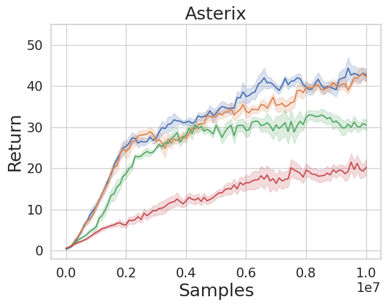

# Official Implementation of Deep Variance Weighting (DVW) [Experiments in Section 7.2.2]

This repository is the official implementation of Deep Variance Weighting for the MinAtar experiments in [Regularization and Variance-Weighted Regression Achieves Minimax Optimality in Linear MDPs: Theory and Practice](TODO).

* We modified [CleanRL](https://github.com/vwxyzjn/cleanrl) repository (commit [d67ae0c](https://github.com/vwxyzjn/cleanrl/commit/d67ae0cd67f786864372181629d5e438699c9856)) and [MinAtar](https://github.com/kenjyoung/MinAtar) repository (commit [548b136](https://github.com/kenjyoung/MinAtar/commit/548b136885d1c387ddfe15e45ec774b7254e2ee5)).
* You can see the implementation of M-DQN with DVW in [cleanrl/dqn_minatar.py](cleanrl/dqn_minatar.py) (or [cleanrl/dqn.py](cleanrl/dqn.py)).
We leave other files same as the original [CleanRL](https://github.com/vwxyzjn/cleanrl).





## Requirements

* Step 1: Install dependencies
```bash
# make sure you are in Variance-Weighted-MDVI/Deep-Variance-Weighting-MinAtar
poetry install

# Install MinAtar in submodule
poetry shell
git submodule update --init && cd MinAtar
pip install -e .
```

* Step 2: Login to wandb (for ease of visualization and plotting)

```bash
wandb login # only required for the first time
```

You can test if everything works by:

```bash
# If you have something wrong with GPU, please replace "--device cuda" with "--device cpu"

# Weighted M-DQN
poetry run python cleanrl/dqn_minatar.py --total-timesteps 50000 --env-id breakout --track --wandb-project-name minatar-test --exp-name Weight-Net-M-DQN --weight-type variance-net --device cuda
# M-DQN
poetry run python cleanrl/dqn_minatar.py --total-timesteps 50000 --env-id breakout --track --wandb-project-name minatar-test --exp-name M-DQN --weight-type none --device cuda

# Weighted DQN
poetry run python cleanrl/dqn_minatar.py --total-timesteps 50000 --env-id breakout --track --wandb-project-name minatar-test --exp-name Weight-Net-M-DQN --weight-type variance-net --kl-coef 0.0 --ent-coef 0.0 --device cuda
# DQN
poetry run python cleanrl/dqn_minatar.py --total-timesteps 50000 --env-id breakout --track --wandb-project-name minatar-test --exp-name DQN --weight-type none --kl-coef 0.0 --ent-coef 0.0 --device cuda
```

## Run MinAtar Experiments

Run ```bash run_minatar.bash```


## Plot results

Run all the cells in [minatar-results/result-plotter.ipynb](minatar-results/result-plotter.ipynb).
The figures will be saved in [minatar-results](/minatar-results/) directory.


## (Optional) Classic Control

If you are interested in other environments, try the following for classic controls:

```bash
# If you have something wrong with GPU, please replace "--device cuda" with "--device cpu"

# Weighted M-DQN
poetry run python cleanrl/dqn.py --total-timesteps 50000 --env-id CartPole-v1 --track --wandb-project-name classic-control-test --exp-name Weight-Net-M-DQN --weight-type variance-net  --device cuda
# M-DQN
poetry run python cleanrl/dqn.py --total-timesteps 50000 --env-id CartPole-v1 --track --wandb-project-name classic-control-test --exp-name M-DQN --weight-type none --device cuda 

# Weighted DQN
poetry run python cleanrl/dqn.py --total-timesteps 50000 --env-id CartPole-v1 --track --wandb-project-name classic-control-test --exp-name Weight-Net-M-DQN --weight-type variance-net --kl-coef 0.0 --ent-coef 0.0 --device cuda
# DQN
poetry run python cleanrl/dqn.py --total-timesteps 50000 --env-id CartPole-v1 --track --wandb-project-name classic-control-test --exp-name DQN --weight-type none --kl-coef 0.0 --ent-coef 0.0 --device cuda 
```
